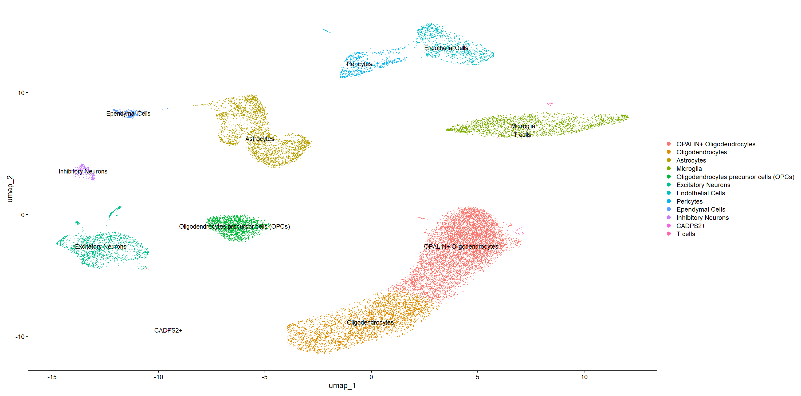
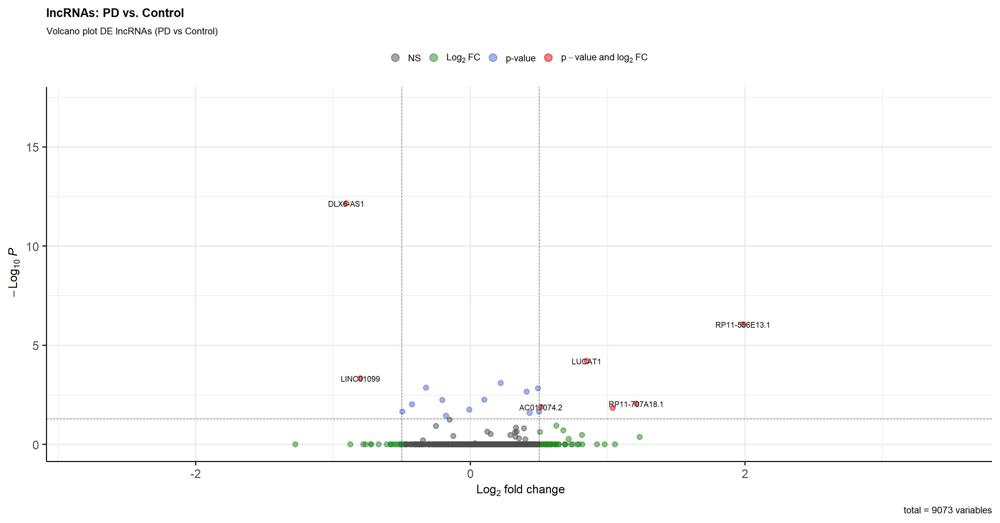
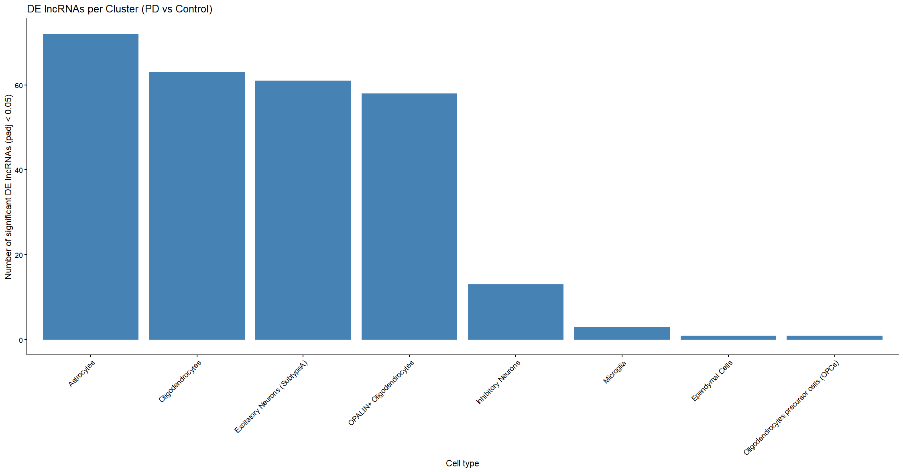
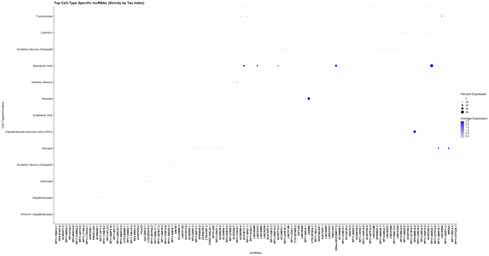
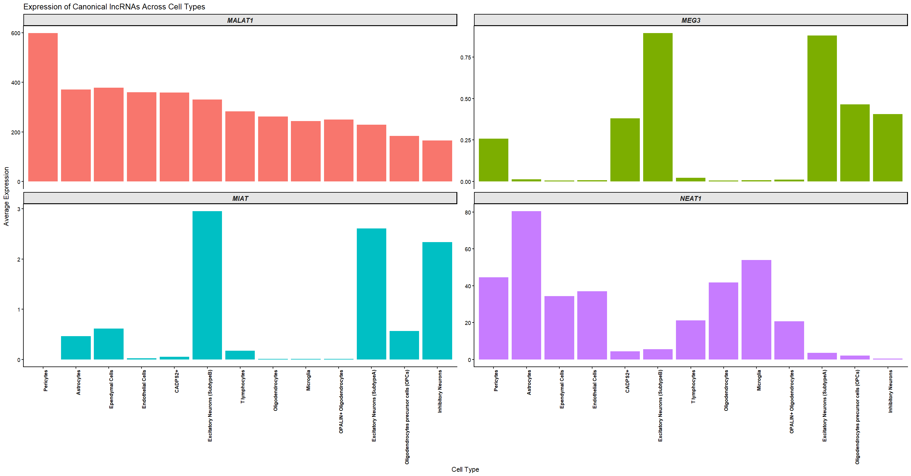

# Identifying Long Non-Coding RNAs (lncRNAs) in Idiopathic Parkinsons Disease (PD)

## Background & Motivation

Parkinson’s disease (PD) is a neurological disorder, characterized by the progressive loss of dopaminergic neurons in the *Substantia Nigra pars compacta* (SNpc). While traditional transcriptomic analyses have focused predominantly on protein-coding genes, long non-coding RNAs (lncRNAs) have emerged as master regulators of brain development, gene regulation, and synaptic plasticity in the central nervous system. Dysregulation of lncRNAs is associated with neurodegenerative disorders including PD. 

Recent studies show that lncRNAs regulate cell-specific pathways in PD including the survival of dopaminergic neurons, microglial neuroinflammation and glial dysfunction. Recent studies have also highlighted specific cell populations that produce lncRNAs within SNpc. However, the original single-nucleus RNA sequencing (snRNA-seq) study of human midbrain samples [GSE157783](https://www.ncbi.nlm.nih.gov/geo/query/acc.cgi?acc=GSE157783) focused primarily on general cell-type diversity and protein-coding gene expression. To address this gap, this project re-analyzes `GSE157783` snRNA-seq dataset from PD patients and healthy controls to identify, score, and evaluate lncRNA dynamics across specific midbrain cell types.


### Objectives

1. **Cell-Type Specificity Mapping ($\tau$ Index):** Quantify and rank cell-type specific lncRNA markers across major midbrain populations (including Astrocytes, Microglia, Pericytes, Oligodendrocytes, and Neurons) using the Tau ($\tau$) specificity index.
2. **Disease-State Differential Expression:** Profile global and cell-type specific non-coding transcriptional alterations between idiopathic PD and control brain tissue.


## Methodology

### Data Acquisition & Preprocessing
* **Dataset**: Single-nucleus RNA sequencing (snRNA-seq) data from human post-mortem midbrain tissue from Idiopathic Parkinson’s Disease patients and matched controls (`GSE157783`).
* **Matrix Formatting**: Raw expression count matrices were converted into sparse matrices (`dgCMatrix`) in R.
* **Gene Annotation**: Ensembl gene IDs were converted to official HGNC Gene Symbols using the Ensembl database (`EnsDb.Hsapiens.v86`). Duplicate mappings were resolved using `make.unique()`.


### Preprocessing, Clustering & Annotation

Nuclei were filtered for quality (nCount_RNA > 1500, nFeature_RNA > 1000, percent.mt < 10%; no mitochondrial genes were detected in this dataset). Doublets were removed using `scDblFinder`. Data were normalized (`NormalizeData`), scaled, and reduced via PCA (top 20 of 50 PCs retained per elbow-plot inspection). 
Patient-level batch effects were corrected with Harmony prior to UMAP embedding and graph-based clustering (resolution = 0.1, yielding 13 clusters). Clusters were annotated using canonical markers from the original study and CellMarker2.0 
(see table below).

| Cell type | Markers |
|---|---|
| Astrocytes | *AQP4*, *GFAP* |
| Oligodendrocytes | *MOBP*, *MBP*, *MOG*, *OPALIN* |
| Oligodendrocytes Precursor Cells (OPCs) | *PDGFRA*, *VCAN*, *PCDH15* |
| Microglia | *CD74*, *APBB1IP* |
| Endothelial | *CLDN5* |
| Pericytes | *PDGFRB*, *RGS5*, *NOTCH3*, *ABCC9* |
| Excitatory neurons | *SLC17A6* |
| Inhibitory/GABAergic neurons | *GAD1*, *GAD2*, *GRIK1* |
| Ependymal cells | *FOXJ1* |
| T-lymphocytes | *ITK*, *IL7R*, *CD96* |


### Long Non-Coding RNA (lncRNA) Identification & Cell-Type Specificity
* **lncRNA Filtering**: Transcripts were annotated via `EnsDb.Hsapiens.v86` and filtered for lncRNA biotypes (`lincRNA`, `antisense`, `sense_overlapping`, `processed_transcript`).
* **Cell-Type Specificity Score ($\tau$ Index)**: Calculated to quantify lncRNA cell-type specificity across clusters using average linear expression values:
  $$\tau = \frac{\sum_{i=1}^{N} \left(1 - \frac{x_i}{x_{\max}}\right)}{N - 1}$$
* **Specific Expression Scoring**: LncRNAs were ranked by multiplying mean expression values by their calculated Tau ($\tau$) indices.


### Differential Expression Analysis (PD vs. Control)
Differential expression analysis was performed using a pseudobulk approach: counts were aggregated per patient (and per patient per cell type, for cluster-level comparisons) and tested with `DESeq2`, using patient (n=5 PD, n=6 Control) as the unit of replication rather than individual nuclei. Per-cell-type comparisons used the `muscat` package.

## Results

The counts matrix from human post mortem midbrain tissues from 11 individuals (5 idiopathic PD & 6 controls) was obtained and loaded into RStudio. The matrix consisted of 26737 genes from 41435 cells. Initial QC showed that no mitochondrial genes were present in the dataset. First 20 PCs showed the most variation and hence were selected for downstream analysis. Clustering was performed at 0.1 resolution and resulted in 13 clusters, which were annotated using canonical markers from the original paper and CellMarker2.0. Clustering analysis showed that dataset consisted of oligodendrocytes, astrocytes, ependymal cells, inhibitory neurons, excitatory neurons, pericytes and PD specific CADPS2+ cells ([Figure 1](#figure1)). This CADPS2 cell cluster have also been identified by the authors and hypothesized to be idiopathic PD specific. Additionally, T-lymphocytes and two specific subtypes of Excitatory neurons were found in this analysis. 

<figure id="figure1" style="text-align: center; margin-bottom: 25px;">
  
  <figcaption><b>Figure 1:</b> Annotated Clusters </figcaption>
</figure>

<br><br>


Four different types of lncRNAs were found in the dataset, including long intergenic non-coding RNA (lincRNAs), antisense RNAs, processed transcripts and sense overlapping RNAs. In total, the dataset contained 9073 lncRNAs. Differential expression analysis was performed to compare the expression of lncRNAs between PD and controls. 19 lncRNs were found to be significantly DE in PD ([Figure 2](#figure2)). DE analysis of lncRNA was also used to compare the expression of lncRNAs between different cell types of PD and controls ([Figure 3](#figure3)). Astrocytes showed the highest number of DE lncRNAs (72), followed by Oligodendrocytes (63). Microglia had just 3 DE lncRNAs while Ependymal cells and OPCs had just 1 DE lncRNA. 

<figure id="figure2" style="text-align: center; margin-bottom: 25px;">
  
  <figcaption><b>Figure 2:</b> Volcano plot showing differentially expressed lncRNAs in PD </figcaption>
</figure>

<br><br>

<figure id="figure3" style="text-align: center; margin-bottom: 25px;">
  
  <figcaption><b>Figure 3:</b> Number of DE lncRNAs in each cell type in PD </figcaption>
</figure>

<br><br>


$\tau$ index  was used to determine PD specific lncRNAs. Plotting the $\tau$ index of all cell types ([Figure 4](#figure4)) showed that, *CARMN* is specific to Pericytes ($\tau$ = 0.997), *MIR223* ($\tau$ = 0.996) and *RP11-489O18.1* ($\tau$ = 0.9969) lncRNAs are specific to microglia  and *RP11-356K23.1* ($\tau$ = 0.9956)is specific to ependymal cells, however de analysis results showed that none of these lncRNAs are significantly upregulated or downregulated in PD or in any of cell types within PD. 

<figure id="figure4" style="text-align: center; margin-bottom: 25px;">
  
  <figcaption><b>Figure 4:</b> $\tau$ index of top lncRNAs from each cluster </figcaption>
</figure>

<br><br>


Additionally, the expression of well explored lncRNAs such as *NEAT1*, *MEG3*, *MALAT1* and *MIAT* was analyzed ([Figure 5](#figure5)). While different cell types showed the expression of these lncRNs (Pericytes showed highest expression of *MALAT1*, *NEAT1* was highly expressed in Astrocytes while Excitatory neurons showed expression of *MIAT* and *MEG3*), none of these lncRNAs had $\tau$ index close to 1, indicating broad expression across cell types rather than cell-type restriction.

<figure id="figure5" style="text-align: center; margin-bottom: 25px;">
  
  <figcaption><b>Figure 5:</b> Expression of known lncRNAs in PD in cell clusters </figcaption>
</figure>

<br><br>


## Limitations

- **Limited number of patients (n=5 PD, n=6 Controls):** Combining single-cell data into donor-level samples is the correct statistical method, but this small sample size limits our power to detect changes. 
- **Low cell counts in rare cell types:** Smaller cell groups, such as Pericytes, Ependymal Cells, and T lymphocytes, do not have enough cells across all donors to produce reliable donor-level averages. Therefore, results for these rare cells should be considered preliminary and exploratory.

## Getting Started

To run this pipeline locally, open your terminal, clone the repository, and navigate into the project directory:
```
git clone https://github.com/razmia02/snrna_pd.git
cd snRNAseq_Parkinsons_lncRNA
```

### Environment Setup

This project uses renv to manage R package dependencies. You do not need to install packages manually.
Open the project in RStudio (open snRNA-seq_PD.Rproj if available, or set your working directory to this folder).

Run the following command in your R console to automatically install all packages specified in the renv.lock file:
```
renv::restore()
```

### Run the Analysis

Once your environment is restored, ensure your GSE157783 input files are placed in the `Data/` directory, then run the R scripts in `scripts/` directory:

Script for Pre-processing, QC, doublet removal, normalization, scaling and clustering:
```
Rscript scripts/01_Preprocessing.R
```

Script for cluster analysis, marker identification and cluster annotation:
```
Rscript scripts/02_Clustering_Annotation.R
```
Script for lncRNA analysis including DE analysis, $\tau$ index calculation and visualization:
```
Rscript scripts/03_lncRNA_Analysis.R
```

All outputs, including cell-type specificity scores (Tau index), cell cluster annotations, differential expression results, and visualization plots, will be saved automatically into the `Results/` and `Plots/` directories.

---

## Repo Structure

```
.
├── Data 		# Directory to store raw matrix/barcodes/tsv files
├── Plots 		# Plots for visualization
├── Results		# Result files in csv format
├── scripts
│   ├── 01_Preprocessing.R  # R script for QC, normalization, scaling, clustering
│   ├── 02_Clustering_Annotation.R  # R script to find cluster markers & cluster annotation
│   └── 03_lncRNA_Analysis.R  # R script for lncRNA analysis
├── readme.md 				# Project Readme.md file
├── seurat.rds 				# Saved seurat object in rds format
└── snRNA-seq_PD.Rproj    # R project file
```

---

## References

- [GEO Dataset](https://www.ncbi.nlm.nih.gov/geo/query/acc.cgi?acc=GSE157783)
- [Original Study](https://pmc.ncbi.nlm.nih.gov/articles/PMC9050543/)